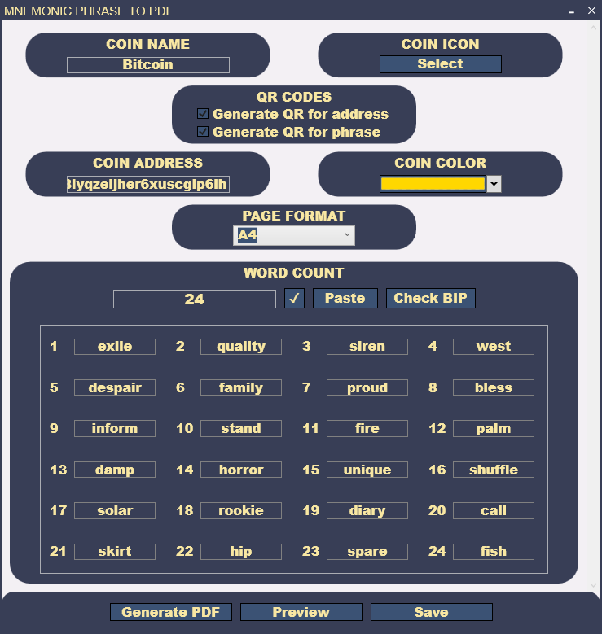
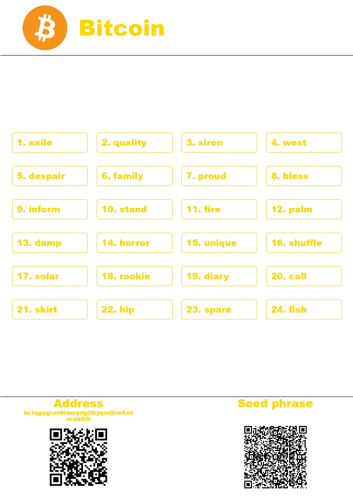

# MnemonicPDF

     
 

MnemonicPDF is a Windows Presentation Foundation (WPF) application that allows users to generate a PDF file from their mnemonic crypto phrase. With MnemonicPDF, users can customize their PDF files by selecting custom icons, elements colors, and page size formats and many other things.

## Features
* Customizable coin icon/logo and color of elements  for the PDF file
* Validation of the entered mnemonic phrase to ensure that it follows the BIP word list
* Custom page size formats for the PDF file
* Ability to provide a coin address and generate QR codes for the address and the mnemonic phrase
* PDF generation, preview, and saving
* User-friendly interface

     
 

## Requirements
MnemonicPDF requires a Windows operating system and .NET 6.

## Usage
### To use MnemonicPDF, follow these steps:
* Launch the MnemonicPDF application.
* Enter your mnemonic phrase in the provided text box.
* If desired, enter a coin address in the provided text box.
* Customize the coin icon/logo, text and border color (optional).
* Select the desired page size format.
* Click the "Generate PDF" button.
* Preview the PDF file to ensure that it displays your mnemonic phrase and coin address correctly.
* If satisfied with the preview, click the "Save PDF" button to print file or save the file to your device.

### To be able to save the file, set up [Microsoft Print to PDF](https://answers.microsoft.com/en-us/windows/forum/all/how-to-add-or-reinstall-the-microsoft-pdf-printer/70377c34-e50a-42be-b9f3-92345d6e25df):
* Click the Windows Start menu and type "Printers & Scanners".
* Open the "Printers & Scanners" settings.
* Click on "Add a printer or scanner".
* Select "The printer that I want isn't listed".
* Select "Add a local printer or network printer with manual settings" and click "Next".
* Select "Use an existing port" and then choose "FILE: (Print to file)" from the drop-down menu.
* In the "Install the printer driver" window, select "Microsoft" as the manufacturer and "Microsoft Print to PDF" as the printer.
* Follow the installation wizard to complete the setup.
* Once the setup is complete, the Microsoft Print to PDF printer will be available in the Print dialog when you select "Print" from within an application.

### Here's an example of a generated PDF file:

    
 

# Contributing
If you want to contribute to the development of MnemonicPDF, please fork this repository and submit a pull request with your changes.
